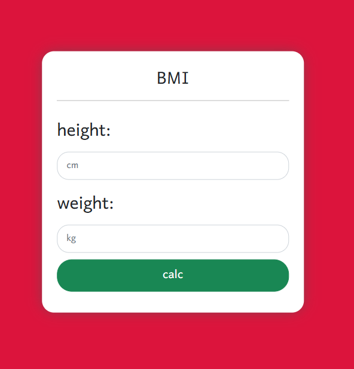

# 🧮 BMI Calculator

A simple BMI (Body Mass Index) calculator built with vanilla HTML, CSS, and JavaScript.

---

## 📷 Screen Shot

## 

---

## 📐 Features

- 🏋️‍♂️ Enter height in centimeters and weight in kilograms
- ⚡ Calculates BMI instantly on button click
- 📊 Displays the BMI result dynamically
- 🧼 Clean and minimal form design using custom CSS

---

## 🚀 Technologies Used

- HTML5
- CSS3
- JavaScript (ES6)

---

## 🧠 Formula Used

\[
\text{BMI} = \frac{\text{weight in kg}}{(\text{height in meters})^2}
\]

**Note:** Height entered in centimeters is converted to meters in the script.
