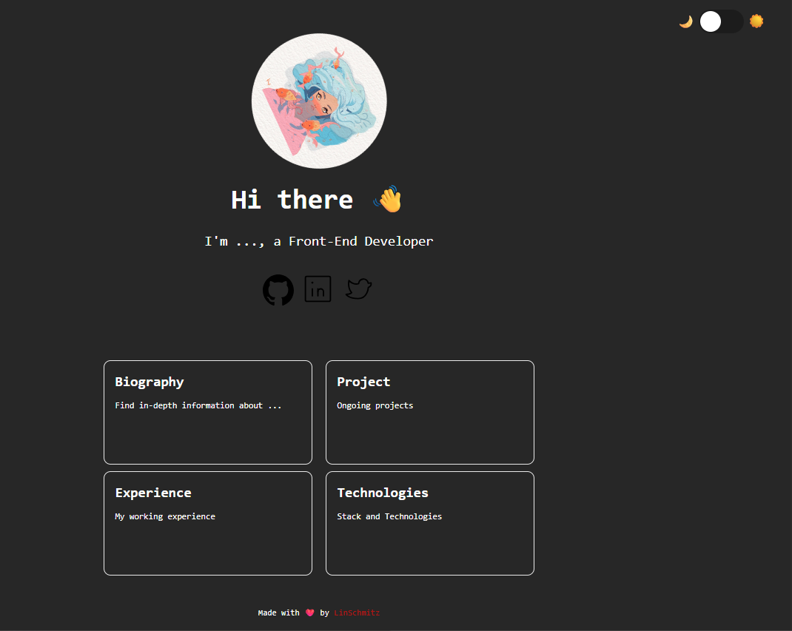

# 🌐 Personal Portfolio Website

Welcome to my personal portfolio website built using **HTML**, **CSS**, and **JavaScript**.
This website serves as my digital space to showcase my skills, projects, and online presence.

---

## ✨ Features

- 🎨 **Dark/Light Mode Toggle** – switch between themes using the sun/moon icon.
- 👋 Interactive welcome section with emojis and profile image.
- 🔗 Social media integration (GitHub, LinkedIn, Twitter).
- 📦 Organized sections: Biography, Experience, Projects, and Technologies.
- ❤️ Stylish footer with credit and GitHub profile link.

---

## 🔧 How to Use

1. Clone the repository:

```bash
git clone https://github.com/your-username/your-repo-name.git
```

2. Open `index.html` in your browser to see it in action.

---

## 🛠️ Technologies Used

- HTML5
- CSS3
- JavaScript (Vanilla)

---

## 🚀 Live Demo

> [🌍 Portfolio Live Site](https://yourusername.github.io/your-repo-name/)

---

## 📸 Preview

## 

---

> Made with ❤️ by [LinSchmitz](https://github.com/LinSchmitz)

---

Let me know if you want me to auto-fill your real name, GitHub handle, or social links.
