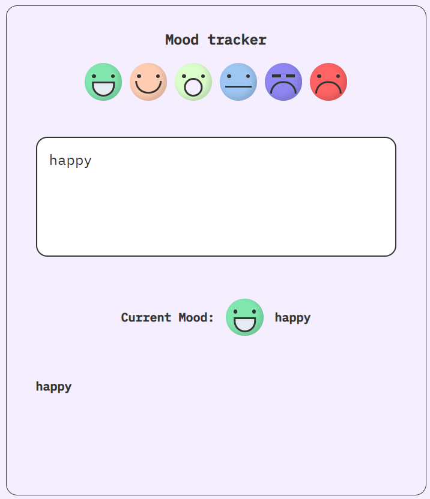
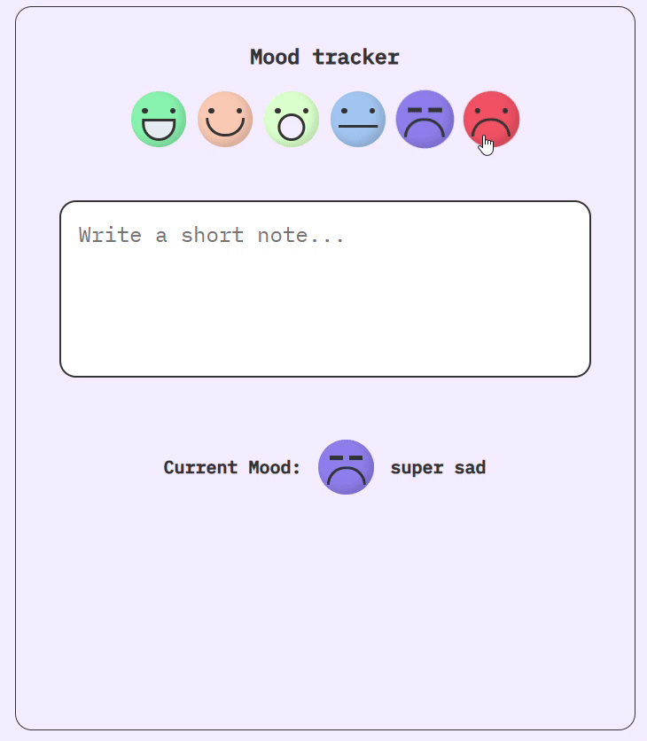

# 😄 Mood Tracker App

A simple and interactive React app that lets users track their current mood. Built for practicing React state management with `useState`.

### 📸 Preview

### ✨ Features

- 🌈 Choose your mood from a set of emoji options
- 📝 Add a personal note about how you feel
- 📆 See the currently selected mood and note
- 🔄 Reset mood and start over

### 🧠 Concepts Practiced

- React Functional Components
- `useState` Hook
- Conditional Rendering
- Event Handling
- Simple Component Composition
