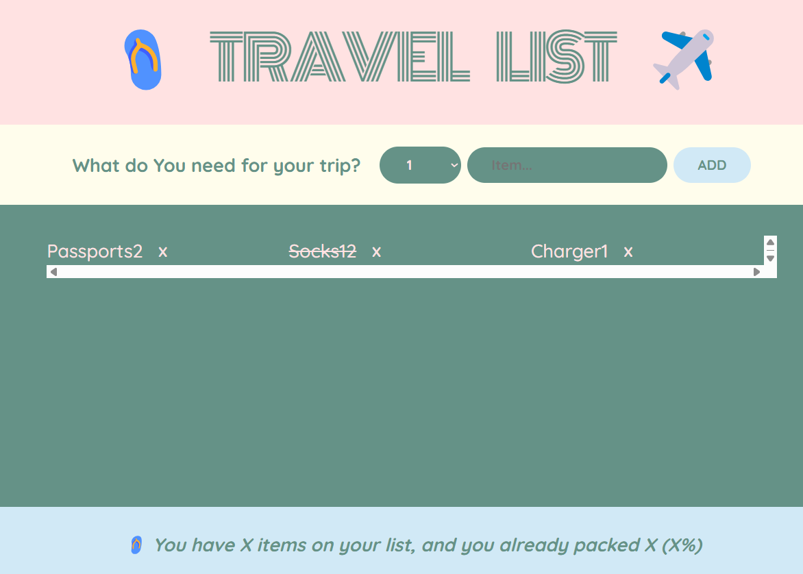

# All my js mini project from multiple courses

## 🚀 still updating

---

# 😄 Mood Tracker App

A simple and interactive React app that lets users track their current mood. Built for practicing React state management with `useState`.

---

## 📸

---

## ✨ Features

- 🌈 Choose your mood from a set of emoji options

- 📝 Add a personal note about how you feel

- 📆 See the currently selected mood and note

- 🔄 Reset mood and start over

---

## 🧠 Concepts Practiced

- React Functional Components

- `useState` Hook

- Conditional Rendering

- Event Handling

- Simple Component Composition

---

## <video controls src="public/img/modeTracker.mp4" title="Title"></video>

# 🧳 Travel List App

A simple React app to manage your travel items, allowing you to add, track, and mark items as packed for your upcoming trip.

## ✨ Features

- 🛍 Add items with their quantity to your packing list

- ✅ Mark items as packed

- 🔄 Toggle between packed and not packed status

- 📊 View stats for total items and packed items

## 🛠 Tech Stack

- ⚛️ React

- 🎨 CSS

---

# 📅 Date Slider App

A fun and interactive React app that calculates the date based on a counter. Use a <strong>step slider</strong> to increase or decrease by custom intervals and explore past or future dates!

## ✨ Features

- ➕➖ Increment or decrement a counter by a custom step value

- 📅 Dynamically calculates the date based on the counter

- 🧮 Type in a value or use buttons to change the count

- 🎚 Adjustable step range from 0 to 10

## 🛠 Tech Stack

- ⚛️ React (useState)

- 💅 CSS for styling

## 🚀 How It Works

- `step`: Controls how much to increase/decrease the count

- `count`: Tracks how many days to shift from today

- `new date`: JavaScript Date API updates the display in real time

## 🧠 Concepts Practiced

- useState hooks for managing UI state

- Controlled components (inputs, range)

- Date manipulation in JavaScript

---

# 🧠 React Flashcard App

A simple Flashcard App built with React to practice JavaScript interview questions and state management.

## ✨ Features

- 🖱️ Click to reveal or hide answers
- ⚙️ State management with `useState`
- 🔁 Conditional rendering and dynamic styling
- 🧱 Clean and reusable component structure

## 🛠 Tech Stack

- ⚛️ React
- 🎨 CSS

---

# 🧠 Random Advice Generator App(getAdvise)

A small and fun ReactJS project that fetches random life advice from the Advice Slip API and displays it on the screen. Great for practicing React Hooks (useState, useEffect), working with APIs, and learning about API caching issues.

## ✨ Features

🔄 Fetches random advice from an external API

💡 Displays a new advice every time the button is clicked

🧮 Keeps track of how many advices you've seen

🎯 Simple and minimal UI

## 🧰 Tech Stack

⚛️ React (with Hooks)

📦 JavaScript (ES6+)

🎨 HTML & CSS

---

# 🗓️ Date Counter App

A simple and interactive React app that helps you explore `useState`, perform dynamic updates, and manipulate dates based on user input. Great for learning how state updates can drive UI changes in real time.

## ✨ Features

- 🔁 Adjust the **step** value to control how much the counter increases or decreases.

- ➕➖ Increment or decrement the **count** by the current step.

- 📅 Dynamically calculates and displays the new date based on the current count.

- 🗓️ Smart messages like “3 days ago” or “5 days from today”.

## 🛠 Tech Stack

⚛️ **React** (with Hooks)

📦 **JavaScript** (ES6+)

🎨 **HTML & CSS**

---

# 🍕 Fast React Pizza.co

A fun and interactive pizza menu app built with React. Explore a list of delicious pizzas, check availability, and see dynamic updates based on opening hours.

## ✨ Features

- 🧾 Displays a dynamic menu of pizzas

- ❌ Marks pizzas as sold out visually

- 🕒 Shows open/closed message based on real-time hours

- 🔁 Conditional rendering and clean component-based architecture

## 🛠 Tech Stack

- ⚛️ React

- 🎨 CSS

---

# 🧠 Developer Profile Card

A personal developer profile card built with React. Includes a profile picture, introduction, and a list of technical skills with visual indicators based on experience level.

## ✨ Features

- 🖼 Displays an avatar and brief developer bio

- 🧪 Lists skills with color-coded experience levels

- 🔁 Dynamic rendering using `map()` and component props

- 🎨 Custom styling with dynamic background colors

## 🛠 Tech Stack

- ⚛️ React

- 🎨 CSS

## 

---

# 🧠 Stepper App

A simple stepper app built with React. It allows the user to navigate through different steps, showing motivational messages with previous and next buttons.

## ✨ Features

- 🧭 Navigate through steps with "Previous" and "Next" buttons

- 🚪 Toggle visibility of the card using the close button

- 🔢 Displays current step and related motivational message

- 🟢 Highlights active steps dynamically

## 🛠 Tech Stack

- ⚛️ React

- 🎨 CSS

## 

---
