# 20+ Web Projects With Vanilla JavaScript

This is the main repository for all of the projects in the course.

- [Course Link](https://www.traversymedia.com/20-Vanilla-JavaScript-Projects)
- [Get Course On Udemy](https://www.udemy.com/course/web-projects-with-vanilla-javascript/?referralCode=F9B7C7FED834F91ADE75)

|  #  |                                                Project                                                 |                               Live Demo                               |
| :-: | :----------------------------------------------------------------------------------------------------: | :-------------------------------------------------------------------: |
| 01  |           [Profile Card](https://github.com/naLeilan/miniAssignments/tree/main/ProfileCard)            |    [Live Demo](https://leilanSchmitz.com/projects/Portfoliocard/)     |
| 02  |     [Movie Seat Booking](https://github.com/naLeilan/miniAssignments/tree/main/movie-seat-booking)     |  [Live Demo](https://leilanSchmitz.com/projects/movie-seat-booking/)  |
| 03  |    [Custom Video Player](https://github.com/naLeilan/miniAssignments/tree/main/custom-video-player)    | [Live Demo](https://leilanSchmitz.com/projects/custom-video-player/)  |
| 04  |    [Exchange Rate Calculator](https://github.com/naLeilan/miniAssignments/tree/main/exchange-rate)     |    [Live Demo](https://leilanSchmitz.com/projects/exchange-rate/)     |
| 05  |  [DOM Array Methods Project](https://github.com/naLeilan/miniAssignments/tree/main/dom-array-methods)  |  [Live Demo](https://leilanSchmitz.com/projects/dom-array-methods/)   |
| 06  |     [Menu Slider & Modal](https://github.com/naLeilan/miniAssignments/tree/main/modal-menu-slider)     |  [Live Demo](https://leilanSchmitz.com/projects/modal-menu-slider/)   |
| 07  |             [Hangman Game](https://github.com/naLeilan/miniAssignments/tree/main/hangman)              |       [Live Demo](https://leilanSchmitz.com/projects/hangman/)        |
| 08  |          [Mealfinder App](https://github.com/naLeilan/miniAssignments/tree/main/meal-finder)           |     [Live Demo](https://leilanSchmitz.com/projects/meal-finder/)      |
| 09  |        [Expense Tracker](https://github.com/naLeilan/miniAssignments/tree/main/expense-tracker)        |   [Live Demo](https://leilanSchmitz.com/projects/expense-tracker/)    |
| 10  |           [Music Player](https://github.com/naLeilan/miniAssignments/tree/main/music-player)           |     [Live Demo](https://leilanSchmitz.com/projects/music-player/)     |
| 11  |    [Infinite Scrolling](https://github.com/naLeilan/miniAssignments/tree/main/infinite_scroll_blog)    | [Live Demo](https://leilanSchmitz.com/projects/infinite_scroll_blog/) |
| 12  |            [Typing Game](https://github.com/naLeilan/miniAssignments/tree/main/typing-game)            |     [Live Demo](https://leilanSchmitz.com/projects/typing-game/)      |
| 13  |     [Speech Text Reader](https://github.com/naLeilan/miniAssignments/tree/main/speech-text-reader)     |  [Live Demo](https://leilanSchmitz.com/projects/speech-text-reader/)  |
| 14  |           [Memory Cards](https://github.com/naLeilan/miniAssignments/tree/main/memory-cards)           |     [Live Demo](https://leilanSchmitz.com/projects/memory-cards/)     |
| 15  |        [LyricsSearch App](https://github.com/naLeilan/miniAssignments/tree/main/lyrics-search)         |    [Live Demo](https://leilanSchmitz.com/projects/lyrics-search/)     |
| 16  |            [Relaxer App](https://github.com/naLeilan/miniAssignments/tree/main/relaxer-app)            |     [Live Demo](https://leilanSchmitz.com/projects//relaxer-app/)     |
| 17  |          [Breakout Game](https://github.com/naLeilan/miniAssignments/tree/main/breakout-game)          |    [Live Demo](https://leilanSchmitz.com/projects/breakout-game/)     |
| 18  |     [New Year Countdown](https://github.com/naLeilan/miniAssignments/tree/main/new-year-countdown)     |  [Live Demo](https://leilanSchmitz.com/projects/new-year-countdown/)  |
| 19  | [Speak Number Guessing Game](https://github.com/naLeilan/miniAssignments/tree/main/speak-number-guess) |  [Live Demo](https://leilanSchmitz.com/projects/speak-number-guess/)  |
| 20  |    [Product Filtering UI](https://github.com/naLeilan/miniAssignments/tree/main/product-filtering)     |  [Live Demo](https://leilanSchmitz.com/projects/product-filtering/)   |

NOTE ON PULL REQUESTS: All of these projects are part of the course. While I do appreciate people trying to make some things prettier or adding new features, we are only accepting pull requests and looking at issues for bug fixes so that the code stays inline with the course

# All my mini React/js project. (🚀 still updating)

### 🛠 Tech Stacks used in projects:

⚛️ React, 📦 JavaScript (ES6+), 🎨 HTML & CSS

+++++++++++++++++++++++++++++++++++++++++++++++
+++++++++++++++++++++++++++++++++++++++++++++++
+++++++++++++++++++++++++++++++++++++++++++++++
+++++++++++++++++++++++++++++++++++++++++++++++
+++++++++++++++++++++++++++++++++++++++++++++++

# 📝 React TextExpander Component

A clean, flexible, and reusable Text Expander component built with React. Perfect for showing previews of long texts with a toggle to expand or collapse the content.

### ✨ Features

👁️ Show only a preview of long text (default: first 10 words)

🔘 Expand or collapse text with a toggle button

🎨 Customizable button color and text

🧩 Can be controlled or uncontrolled (default or always-expanded)

🧱 Easy to style via className prop

🛠 Tech Stack
⚛️ React (Functional Components + Hooks)

💅 Inline CSS for styling buttons

### ✏️ Customization

Prop Type Default Description
collapsedNumWords Number 10 Number of words to show when collapsed
expandButtonText String "Show more" Text for the expand button
collapseButtonText String "Show less" Text for the collapse button
buttonColor String "blue" Color of the expand/collapse button
expanded Boolean false Show text expanded by default
className String - Optional class for styling container

### 🧠 How It Works

useState tracks whether the text is expanded or collapsed.

If collapsed, the component splits the text and shows the first n words followed by ....

Clicking the button toggles between full text and preview.

### 🧪 Future Improvements

Add transition/animation when expanding or collapsing

Improve accessibility (e.g., aria-expanded)

Support for truncating by characters or lines, not just words

Optional ellipsis style (e.g., fadeout)

+++++++++++++++++++++++++++++++++++++++++++++++

# ⭐ React Star Rating Component

A simple, interactive, and reusable Star Rating component built with React. Hover to preview the rating and click to select.
Supports dynamic star counts, hover preview, click-to-select ratings, custom messages, and full styling control.
Perfect for reviews, feedback forms, and user rating interfaces.

## ✨ Features

✅ Dynamic rendering of stars (default: 5)  
✅ Hover effect to preview rating  
✅ Click to select rating  
✅ Optional custom messages per star  
✅ Fully customizable (color, size, maxRating)  
✅ Lightweight and beginner-friendly  
✅ Supports lifting state up via `onSetRating` prop  
✅ Defaults like `defaultRating` built-in

### 📸 Preview

## 🛠 Tech Stack

-⚛️ React (useState, props)

🎨 Inline CSS styles

🧩 SVG Icons

## ✏️ Customization

Prop Type Default Description
maxRating Number 5 Number of stars to display

You can also modify the styles, star icons, or logic to suit your UI preferences.

## 💡 How It Works

useState tracks both selected (rating) and hovered (tempRating) values.

Stars fill based on hover or click.

Star is a reusable child component that handles SVG rendering and events.

Fully customizable by props.

## 🧪 Future Improvements

✅ Accept custom star icons or SVGs

✅ Allow passing custom CSS class

⬜ Keyboard accessibility

⬜ Support for half-star ratings

⬜ Add animations and transitions

⬜ Accessibility labels for screen readers

### ✏️ Props

| Prop            | Type     | Default   | Description                                  |
| --------------- | -------- | --------- | -------------------------------------------- |
| `maxRating`     | Number   | `5`       | Number of stars to display                   |
| `color`         | String   | `#fcc419` | Color of filled stars                        |
| `size`          | Number   | `48`      | Size of each star in pixels                  |
| `message`       | Array    | `[]`      | Custom label under the stars for each rating |
| `defaultRating` | Number   | `0`       | Initial selected rating                      |
| `onSetRating`   | Function | `null`    | Callback function to get the selected rating |
| `className`     | String   | `""`      | Optional CSS class to style the container    |

+++++++++++++++++++++++++++++++++++++++++++++++
dateCounter
+++++++++++++++++++++++++++++++++++++++++++++++
dateSlider
+++++++++++++++++++++++++++++++++++++++++++++++
reusableButton
+++++++++++++++++++++++++++++++++++++++++++++++

🧾 Split a Bill with Friends – React App
This is a simple and interactive React application that allows users to split expenses with friends and keep track of balances. It's a beginner-friendly project demonstrating essential React concepts like useState, component props, conditional rendering, and form handling.

🚀 Features
Add friends with name and avatar

Select a friend to split a bill with

Track who owes whom and how much

Automatically updates balances after each split

Clean and modular component structure

### 📸 Preview

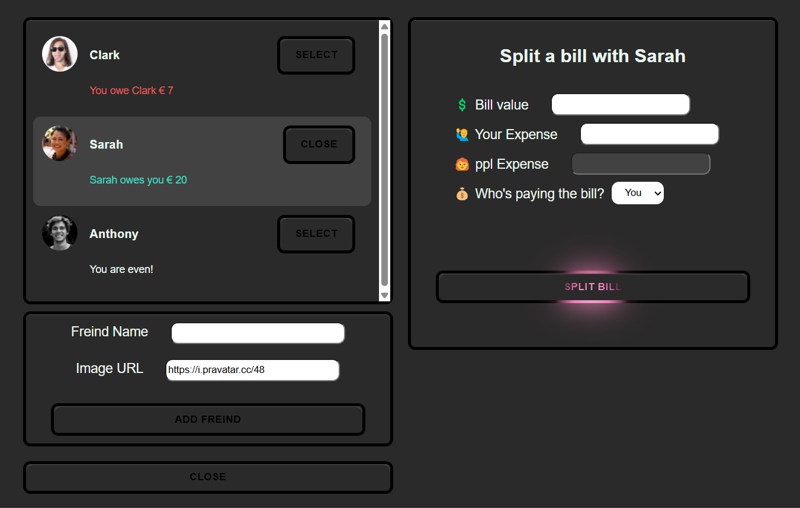

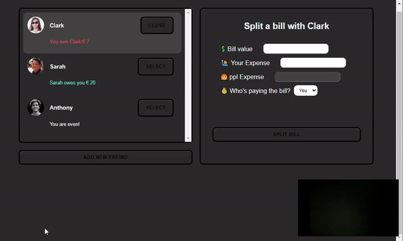

🛠️ Tech Stack
React.js – UI framework

JavaScript – Programming language

CSS – For styling the app (basic class-based styling)

+++++++++++++++++++++++++++++++++++++++++++++++

# 💰 Tip Calculator App (splitBill)

A simple and interactive React app to help you calculate tips based on how you and a friend rate the service.
Built for practicing state management using useState.

### ✨ Features

💵 Enter the total bill amount

🤝 Rate the service from both you and your friend

🧮 Calculates total tip and final amount to pay

🔄 Reset and start over anytime

+++++++++++++++++++++++++++++++++++++++++++++++

# 📚 Accordion Facts

A simple and interactive React app that displays fun random facts in an accordion layout. Built for practicing React components and useState management.

### 📸 Preview

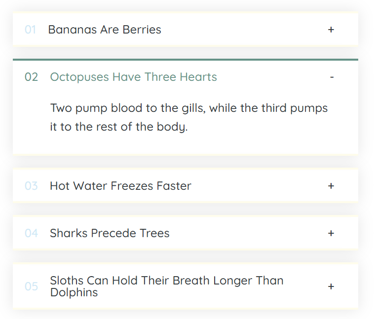

### ✨ Features

🔥 Displays a list of random facts

🧩 Expand or collapse each fact individually

⚛️ Built with React functional components

🎨 Easy to customize and extend

### 🛠️ Built With

useState hook (for opening/closing items)

+++++++++++++++++++++++++++++++++++++++++++++++

# 😄 Mood Tracker App

A simple and interactive React app that lets users track their current mood. Built for practicing React state management with `useState`.

### 📸 Preview

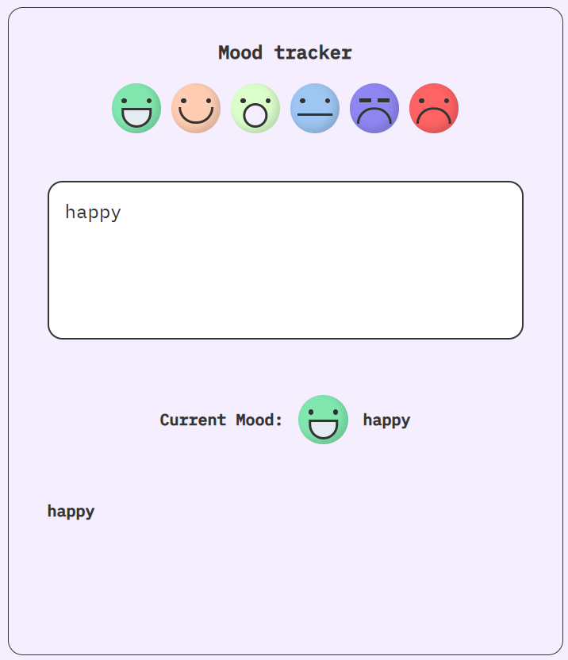

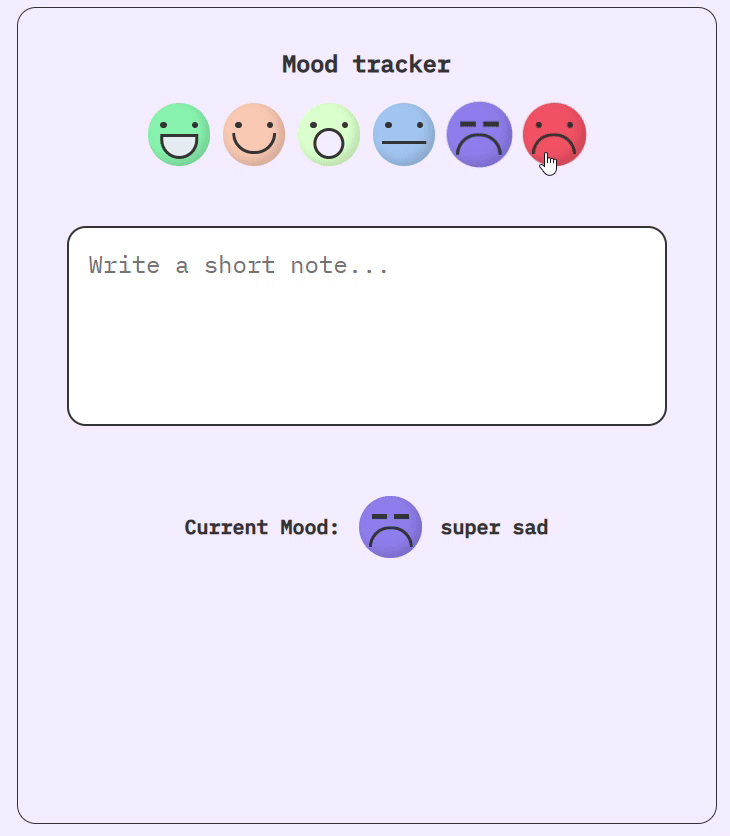

### ✨ Features

- 🌈 Choose your mood from a set of emoji options
- 📝 Add a personal note about how you feel
- 📆 See the currently selected mood and note
- 🔄 Reset mood and start over

### 🧠 Concepts Practiced

- React Functional Components
- `useState` Hook
- Conditional Rendering
- Event Handling
- Simple Component Composition

+++++++++++++++++++++++++++++++++++++++++++++++

# 🧳 Travel List App

A simple React app to manage your travel items, allowing you to add, track, and mark items as packed for your upcoming trip.

### 📸 Preview

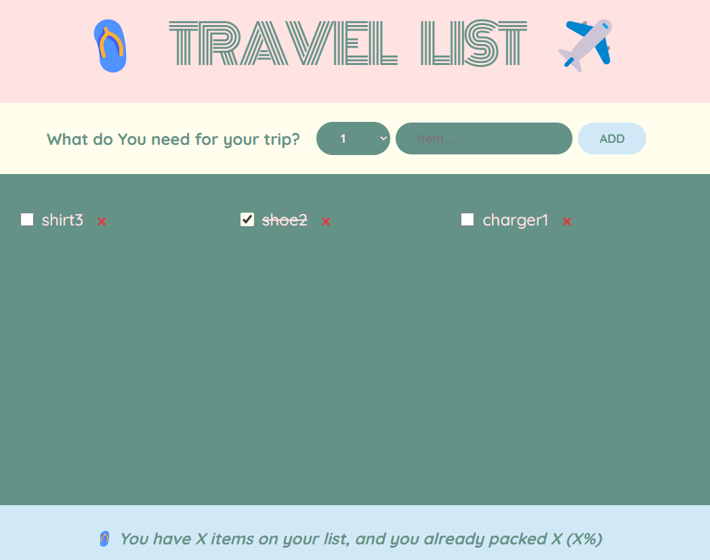

### ✨ Features

- 🛍 Add items with their quantity to your packing list
- ✅ Mark items as packed
- 🔄 Toggle between packed and not packed status
- 📊 View stats for total items and packed items

+++++++++++++++++++++++++++++++++++++++++++++++

# 📅 Date Slider App

A fun and interactive React app that calculates the date based on a counter. Use a <strong>step slider</strong> to increase or decrease by custom intervals and explore past or future dates!

### 📸 Preview

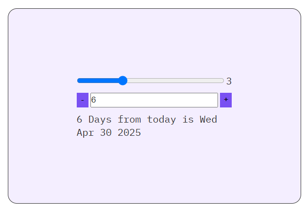

### ✨ Features

- ➕➖ Increment or decrement a counter by a custom step value
- 📅 Dynamically calculates the date based on the counter
- 🧮 Type in a value or use buttons to change the count
- 🎚 Adjustable step range from 0 to 10

### 🚀 How It Works

- `step`: Controls how much to increase/decrease the count
- `count`: Tracks how many days to shift from today
- `new date`: JavaScript Date API updates the display in real time

### 🧠 Concepts Practiced

- useState hooks for managing UI state
- Controlled components (inputs, range)
- Date manipulation in JavaScript

+++++++++++++++++++++++++++++++++++++++++++++++

# 🧠 React Flashcard App

A simple Flashcard App built with React to practice JavaScript interview questions and state management.

### 📸 Preview

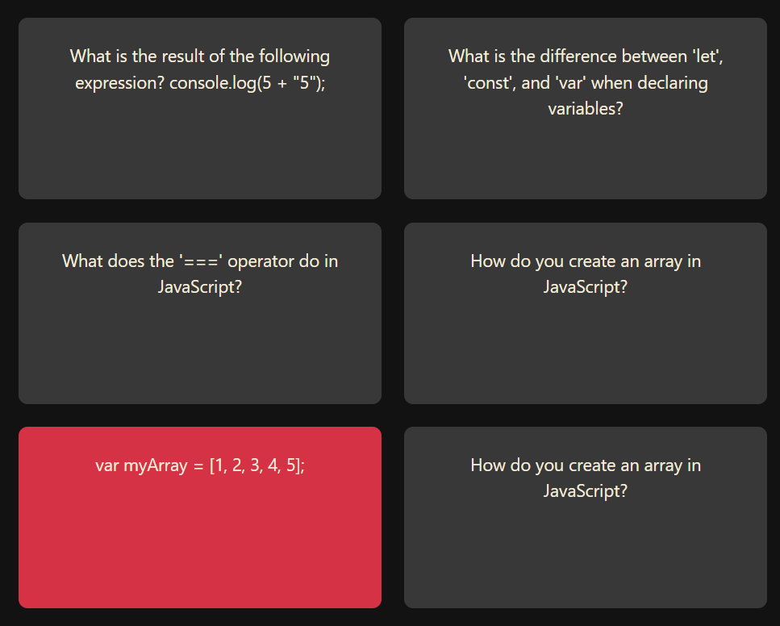

### ✨ Features

- 🖱️ Click to reveal or hide answers
- ⚙️ State management with `useState`
- 🔁 Conditional rendering and dynamic styling
- 🧱 Clean and reusable component structure

+++++++++++++++++++++++++++++++++++++++++++++++

# 🧠 Random Advice Generator App(getAdvise)

A small and fun ReactJS project that fetches random life advice from the Advice Slip API and displays it on the screen. Great for practicing React Hooks (useState, useEffect), working with APIs, and learning about API caching issues.

### 📸 Preview

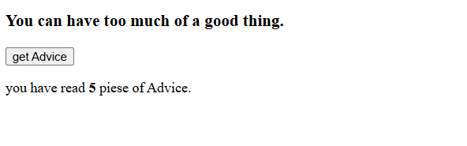

### ✨ Features

🔄 Fetches random advice from an external API

💡 Displays a new advice every time the button is clicked

🧮 Keeps track of how many advices you've seen

🎯 Simple and minimal UI

+++++++++++++++++++++++++++++++++++++++++++++++

# 🗓️ Date Counter App

A simple and interactive React app that helps you explore `useState`, perform dynamic updates, and manipulate dates based on user input. Great for learning how state updates can drive UI changes in real time.

### 📸 Preview

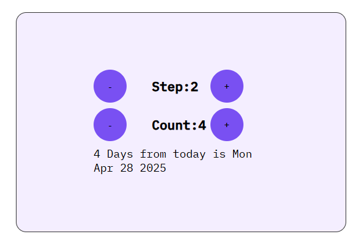

### ✨ Features

- 🔁 Adjust the **step** value to control how much the counter increases or decreases.
- ➕➖ Increment or decrement the **count** by the current step.
- 📅 Dynamically calculates and displays the new date based on the current count.
- 🗓️ Smart messages like “3 days ago” or “5 days from today”.

+++++++++++++++++++++++++++++++++++++++++++++++

# 🍕 Fast React Pizza.co

A fun and interactive pizza menu app built with React. Explore a list of delicious pizzas, check availability, and see dynamic updates based on opening hours.

### 📸 Preview

### ✨ Features

- 🧾 Displays a dynamic menu of pizzas
- ❌ Marks pizzas as sold out visually
- 🕒 Shows open/closed message based on real-time hours
- 🔁 Conditional rendering and clean component-based architecture

+++++++++++++++++++++++++++++++++++++++++++++++

# 🧠 Developer Profile Card

A personal developer profile card built with React. Includes a profile picture, introduction, and a list of technical skills with visual indicators based on experience level.

### 📸 Preview

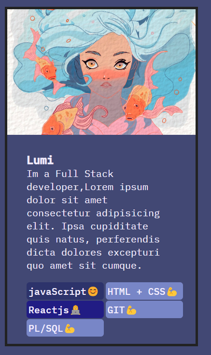

### ✨ Features

- 🖼 Displays an avatar and brief developer bio
- 🧪 Lists skills with color-coded experience levels
- 🔁 Dynamic rendering using `map()` and component props
- 🎨 Custom styling with dynamic background colors

+++++++++++++++++++++++++++++++++++++++++++++++

# 🧠 Stepper App

A simple stepper app built with React. It allows the user to navigate through different steps, showing motivational messages with previous and next buttons.

### 📸 Preview

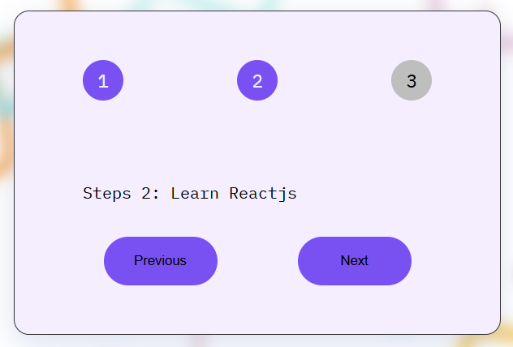

### ✨ Features

- 🧭 Navigate through steps with "Previous" and "Next" buttons
- 🚪 Toggle visibility of the card using the close button
- 🔢 Displays current step and related motivational message
- 🟢 Highlights active steps dynamically

+++++++++++++++++++++++++++++++++++++++++++++++
