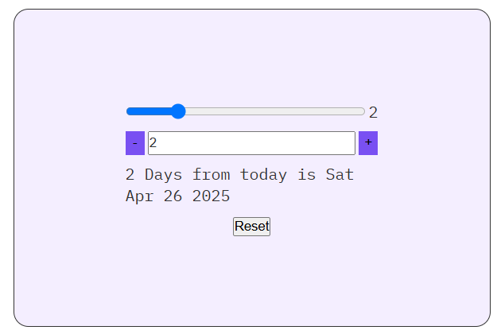

# 📅 Date Slider App

A fun and interactive React app that calculates the date based on a counter. Use a <strong>step slider</strong> to increase or decrease by custom intervals and explore past or future dates!

### 📸 Preview

### ✨ Features

- ➕➖ Increment or decrement a counter by a custom step value
- 📅 Dynamically calculates the date based on the counter
- 🧮 Type in a value or use buttons to change the count
- 🎚 Adjustable step range from 0 to 10

### 🚀 How It Works

- `step`: Controls how much to increase/decrease the count
- `count`: Tracks how many days to shift from today
- `new date`: JavaScript Date API updates the display in real time

### 🧠 Concepts Practiced

- useState hooks for managing UI state
- Controlled components (inputs, range)
- Date manipulation in JavaScript
